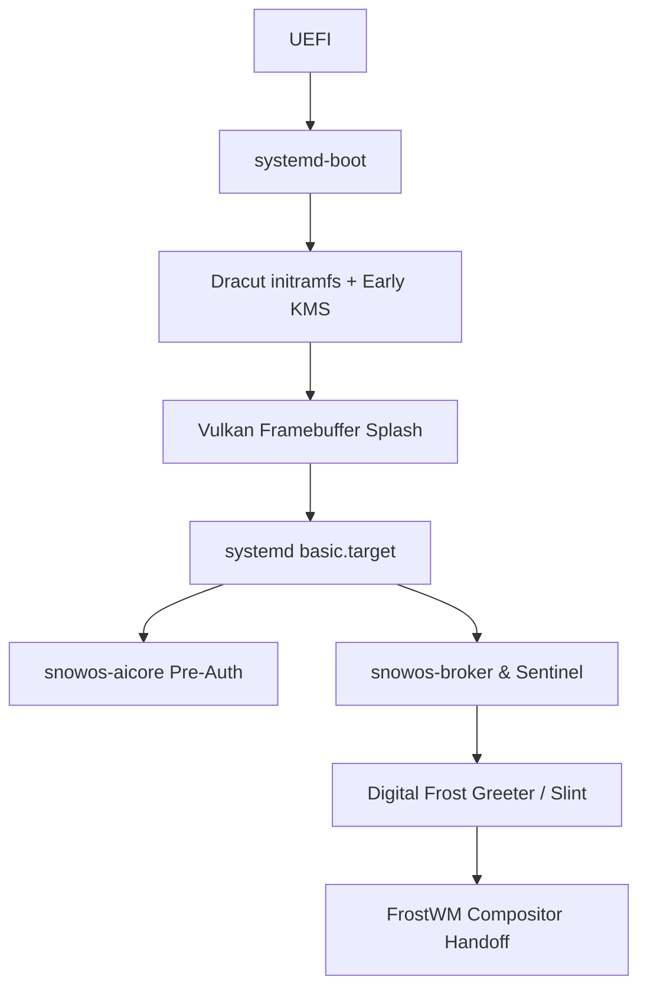

# SnowOS Master Cognitive Architecture Specification

This document serves as the definitive architectural blueprint for transforming SnowOS from a Linux layer into a resilient, self-healing, privacy-preserving cognitive operating environment. It addresses the 20 requested deliverables.

## User Review Required
> [!IMPORTANT]
> This is a massive architectural overhaul. Please review the trust boundaries, boot pipeline rebuild, and ethical constraints to ensure they align with the final SnowOS vision before we begin implementation.

---

## 1. Full Architecture Specification & Tech Stack (Deliv 1, 19)
SnowOS is an immutable, autonomous cognitive OS. The computer behaves spatially, proactively, and adaptively.

**Recommended Technology Stack:**
* **Kernel & Init:** Linux Kernel (locked down), `systemd` (init), `systemd-boot` (bootloader).
* **Compositor:** Rust-based (Smithay) Wayland compositor (FrostWM).
* **UI Framework:** Slint (Rust/Vulkan) for zero-dependency, sub-millisecond drawing.
* **AI Core:** Hybrid Rust (Broker/IPC/Sentinel) and Python/ONNX (Local LLMs/Context Engine).
* **Filesystem:** BTRFS (zstd:3) for atomic snapshots.

---

## 2. Epistemic Layer & Cognitive Memory (Sec 1, Deliv 14)
*Offline-first awareness with secure external reality synchronization.*

* **Reality Confidence Index (RCI):** Every piece of AI knowledge is tagged with an RCI score:
  1. `VERIFIED_LOCAL` (Hardware telemetry, local logs)
  2. `CACHED_EXTERNAL` (Staged WAN sync data)
  3. `SPECULATIVE` (Inferred user intent)
  4. `REALTIME_WAN` (Live web fetch - only available post-auth with user consent)
* **Synchronization Model:** A dedicated `snowos-wan-sync` daemon performs secure, delayed, encrypted fetches over HTTPS/Tor to update the "Cached External" database (weather, news, package manifests).
* **Knowledge Aging:** External data decays over time. After 48 hours offline, `CACHED_EXTERNAL` drops to `UNVERIFIED` and the AI explicitly states it lacks current data.
* **Emergency Offline Reasoning:** Falls back strictly to `VERIFIED_LOCAL` logic.

---

## 3. Pre-Auth Identity & TPM Integration (Sec 2, Deliv 11)
*Intelligent pre-login behavior without compromising private identity.*

* **TPM Integration Flow:**
  1. Bootloader measures firmware & kernel into TPM PCRs (0, 4, 7).
  2. `snowos-aicore` loads in a restricted "Anonymous Pre-Auth" state.
  3. The AI reads public sensors (time, ambient light, boot health).
  4. Digital Frost Greeter utilizes the `snowos-auth-daemon` to perform biometric/conversational negotiation.
  5. Upon successful auth, the TPM unseals the LUKS encryption key for `/var/lib/snowos-ai` (User Context Vault).
  6. AI Core transitions from "Anonymous" to "Personalized".

---

## 4. Trust Boundaries, Security & Threat Model (Deliv 3, 4, 8)
* **Trust Boundaries:**
  * `Ring 0`: Linux Kernel (Lockdown mode).
  * `Ring 1`: systemd, Plymouth/Vulkan Splash, Sentinel (Immutable Core).
  * `Ring 2`: Permission Broker, FrostWM Compositor, AICore.
  * `Ring 3`: User Applications, Epistemic WAN Sync.
* **Security Model:** Strict namespace isolation. The AI core cannot execute arbitrary binaries; it can only request execution via the immutable Permission Broker.
* **Threat Model:** Mitigates offline tampering via TPM Measured Boot. Mitigates recursive AI escalation by mathematically bounding the introspection depth of the Intent Governor.

---

## 5. Self-Reference, Safety & Failure Modes (Sec 3, Deliv 17)
*Preventing cognitive deadlock and infinite self-analysis.*

* **Cognitive Stack Depth:** The AI is limited to 3 layers of introspection. It can analyze a log, hypothesize a failure, and propose a fix. It CANNOT analyze its own hypothesis of its hypothesis.
* **Bounded Self-Modification:** The AI can rewrite `~/.config` files or non-critical service parameters. It CANNOT rewrite the Permission Broker policy or the Sentinel watchdog rules.
* **Failure-Mode Analysis:**
  * *Compositor crash:* Sentinel restarts compositor instantly.
  * *AICore hallucination/deadlock:* Watchdog detects timeout, clears local RAM context, reloads base model weights.
  * *Boot failure:* Automatic BTRFS snapshot rollback after 3 failed `graphical.target` attempts.

---

## 6. Creative Augmentation & Ethical Constraints (Sec 4, Deliv 15)
*Assisting without replacing human agency.*

* **Ethical Constraints:** The AI must NEVER impersonate the user. Suggestions must be non-authoritarian (e.g., "Would you like me to mute notifications?" rather than muting them silently).
* **Ambient Focus Orchestration:** The context engine indexes active workspaces. If the user enters a "flow state" (rapid typing in an IDE, no context switching), the AI automatically suppresses non-critical notifications, dims background UI elements, and optimizes CPU scheduling for the active task.

---

## 7. Boot Pipeline, GPU Fallback & VM Adaptation (Sec 5, Deliv 2, 9, 10)
*Redesigning the boot sequence for zero-flicker, 5-second graphical handoff.*

* **GPU Compatibility & Fallback Hierarchy:**
  1. *Tier 1 (Native AMD/Intel, Nvidia proprietary with DRM modeset):* Full Vulkan shader splash, direct framebuffer handoff, 60fps glassmorphism.
  2. *Tier 2 (Nouveau, Legacy Intel):* Static fade splash, reduced compositor blur.
  3. *Tier 3 (VMware, VirtualBox, LLVMpipe):* **VM Adaptation Model** triggers. Drops all shaders, uses pure alpha transparency, static backgrounds.
* **Eliminating Deadlocks:** GDM/Greeter is forced to wait for `systemd-udev-settle`. Plymouth (or Vulkan splash) is exited with `retain-splash` to prevent VT switch black screens.

---

## 8. Service Topology & systemd Dependency Map (Deliv 5, 6)
* **Dependency Map:**
  1. `sysinit.target`
  2. `snowos-boot.service` (Mounts volatile `/run/snowos`)
  3. `snowos-broker.service` (Before AICore)
  4. `snowos-sentinel.service` (Watchdog)
  5. `snowos-aicore.service` (Headless load)
  6. `graphical.target` -> `snowos-greeter.service`
  7. `snowos-optimizer.service` (Lazy load post-auth)

---

## 9. AI Broker Architecture (Deliv 7)
* **Architecture:** A Rust-based high-speed IPC bus over Unix domain sockets.
* Applications request intents (e.g., `Intent::ReadScreen`). The Broker checks the Immutable Policy Graph. If approved, the request routes to the AICore.

---

## 10. Immutable Filesystem & Recovery (Deliv 12, 13)
* **Filesystem Design:**
  * `/` (Root): Read-only BTRFS subvolume.
  * `/home`: Read-write persistent subvolume.
  * `/var/lib/snowos-ai`: Read-write encrypted subvolume (unsealed by TPM post-auth).
* **Recovery Architecture:**
  * If a boot fails, the bootloader (systemd-boot) automatically increments a fail counter. At 3 fails, it changes the default boot entry to the `n-1` BTRFS snapshot.
  * Graphical Safe Mode: A Slint-based minimal recovery UI that allows the user to manually select snapshots or purge corrupt AI caches.

---

## 11. Performance Optimization Strategy (Deliv 18)
* **Strategy:** EBPF-based profiling during boot. The `snowos-optimizer` lazily compiles GPU shaders during idle time. CPU scheduling is dynamically shifted using AI intent prediction (e.g., dedicating performance cores to the active window while parking background threads).

---

## 12. Future Roadmap & Migration (Sec 6, Deliv 16, 20)
* **Phase 1:** Ubuntu Layer (Current). Custom ISO, GRUB, GNOME/Mutter alterations.
* **Phase 2:** Trans-Immutable Layer. Move to systemd-boot, implement BTRFS snapshot rollbacks, replace Plymouth with Vulkan splash.
* **Phase 3:** Autonomous Platform. Fully independent SnowOS repositories, Rust-based FrostWM, Slint greeter, full TPM/AI identity integration.
* **Phase 4:** Cognitive Ecosystem. Distributed local LLM nodes, predictive contextual scheduling, fully adaptive ambient UI.
