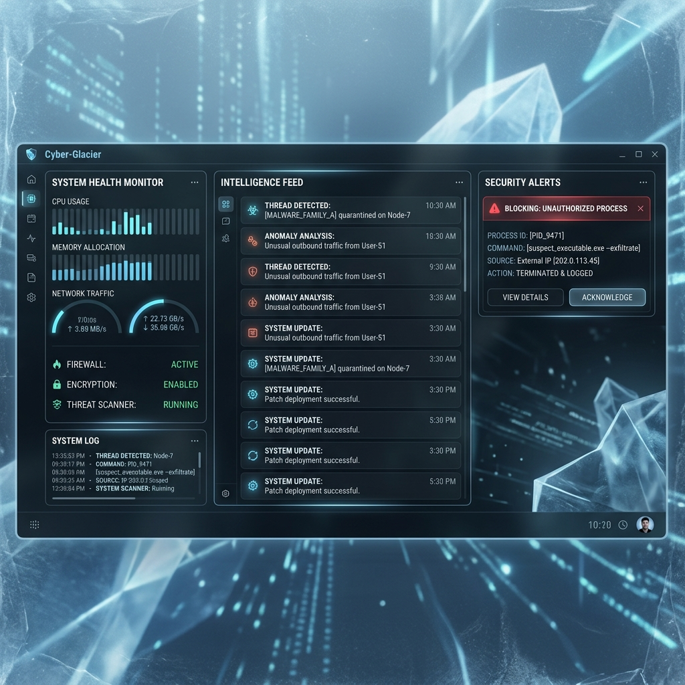

# SnowOS: AI-Native Zero-Trust Operating System Runtime



## What is SnowOS?
Most operating systems treat security as an afterthought and Artificial Intelligence as just another desktop app. SnowOS flips the paradigm.

SnowOS is an **AI-Native Zero-Trust Operating System Runtime** that installs as a secure layer over standard Ubuntu. It is designed around three immutable principles:

1. **Every action is validated.** (Zero Trust Architecture)
2. **Every behavior is monitored.** (AI Sentinel)
3. **Every decision is explainable.** (SnowControl UI)

## Why is it different?
Traditional operating systems allow applications to implicitly trust the kernel and hardware. In SnowOS, nothing is trusted. 

- **Permission Broker:** Applications must request specific cryptographic capability tokens to access the network, file system, or display.
- **AI Sentinel:** A background intelligence daemon that constantly monitors system calls. If an application suddenly exhibits anomalous behavior (e.g., rapid data exfiltration), the Sentinel will instantly isolate and terminate it.
- **Predictive Optimizer:** The OS learns your behavior over time. It proactively tunes kernel CPU priorities (`renice`) and preloads binaries to memory, ensuring the system always feels lightning fast.
- **SnowControl:** A beautiful, frosted-glass "Cyber-Glacier" dashboard that provides total transparency into what the AI is deciding and why.

## Installation
SnowOS v0.1 is currently distributed as a Runtime Overlay for Ubuntu.

```bash
git clone https://github.com/snowos/core
cd core
sudo ./install.sh
```

For detailed setup instructions, read the [Installation Guide](docs/install.md).
For a walkthrough of the system's capabilities, read the [Demo Guide](docs/demo-guide.md).
To understand how the 5-layer IPC socket architecture works, read the [Architecture Guide](docs/architecture.md).
