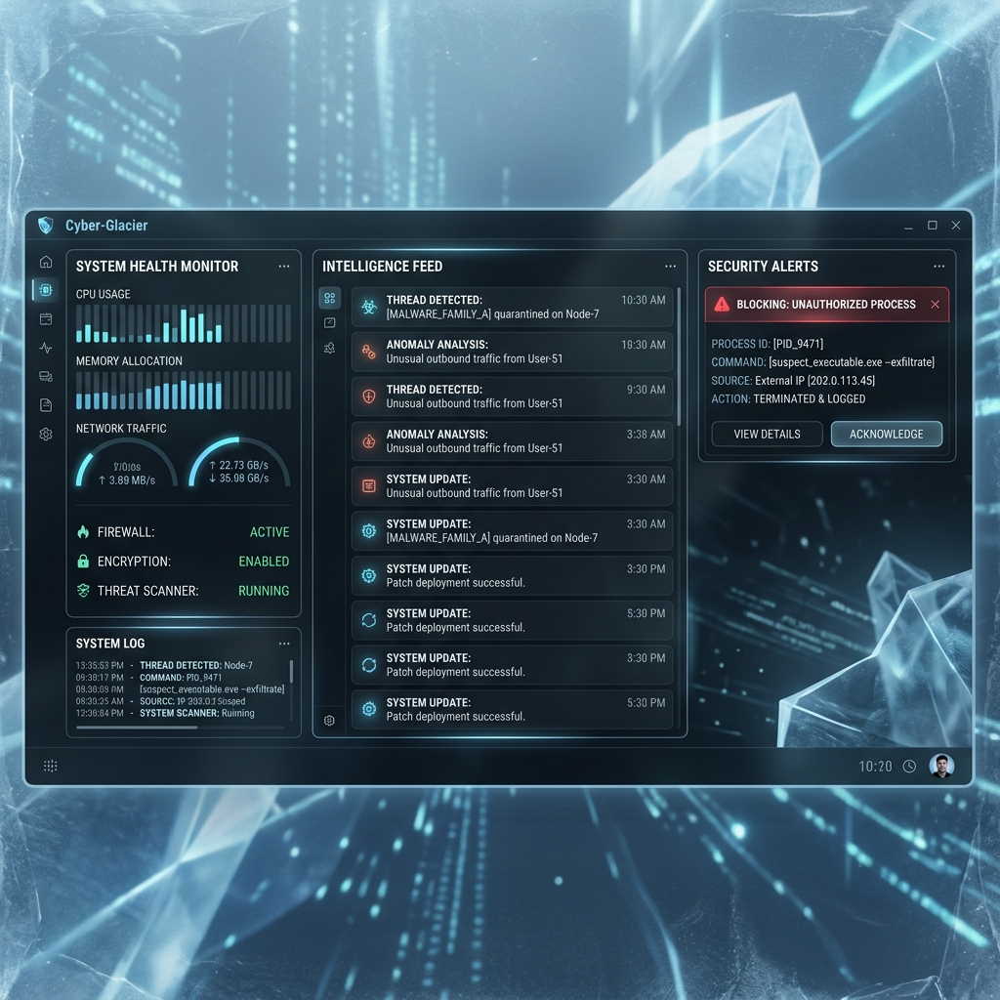

# SnowOS: Your Branded Secure Ubuntu Experience



## What SnowOS Is

SnowOS is a custom Ubuntu-based operating environment with its own branding, visual identity, and hardened service layer.

It is designed around three product pillars:

1. A unique SnowOS desktop identity.
2. A safer local runtime for SnowOS services.
3. A modular split between platform features and visual customization.

## SnowOS Profiles

- `core`: service runtime, local policy layer, validation tooling, and SnowControl.
- `visual`: SnowOS theming, dock behavior, icon identity, and desktop polish.
- `all`: installs both profiles together.

## Design Direction

SnowOS is strongest when treated as a branded secure Ubuntu profile, not a replacement kernel or a fully separate operating system from scratch.

That means the recommended foundation is:

- Ubuntu LTS
- Secure Boot
- LUKS full-disk encryption
- AppArmor
- automatic security updates
- hardened `systemd` services
- a reversible SnowOS visual layer

## Installation

```bash
sudo ./install.sh core
sudo ./install.sh visual
sudo ./install.sh all
```

## Runtime Defaults

- Shared runtime directory: `/run/snowos`
- Boot orchestrator: `snowos-boot.service`
- Platform config: `/etc/snowos/snowos.env`
- Boot manifest: `/etc/snowos/boot_manifest.json`
- AI feature catalog: `/etc/snowos/ai_features.json`
- Integrity manifest: `/etc/snowos/integrity_manifest.json`
- Boot status: `/run/snowos/boot-status.json`
- Capability policy: `/etc/snowos/capabilities.json`
- Brand manifest: `/etc/snowos/brand.json`
- Runtime code: `/opt/snowos`

## Docs

- [Installation Guide](docs/install.md)
- [Architecture Guide](docs/architecture.md)
- [Boot And AI Blueprint](docs/boot-and-ai-blueprint.md)
- [Audit And Target Blueprint](docs/snowos-audit-and-target-architecture.md)
