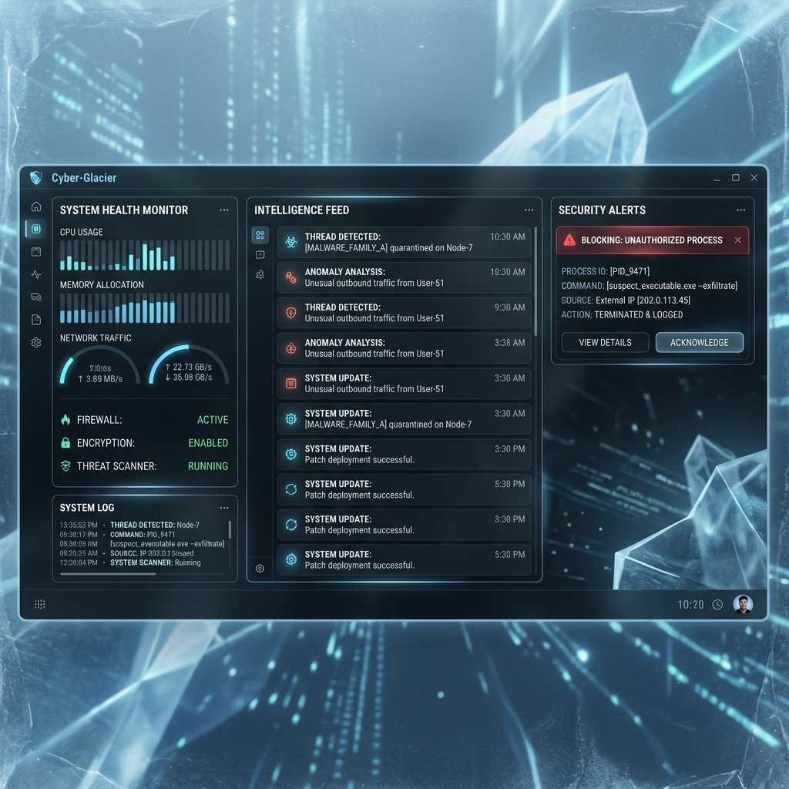

# SnowOS: AI-Native Cyber-Resilient Enterprise Operating System

[](#comprehensive-testing)
[](#the-nj-performance--stability-engine)
[](#snowfs-structured-block-filesystem)
[](#cybersecurity--defense-in-depth)



**SnowOS** is an AI-driven, cyber-resilient, enterprise operating system engineered for high-performance cognitive workloads, fault-isolated stability, and modern aesthetics.

---

## 🏛️ Core Architectural Pillars

### 1. Resource Management & Efficiency
- **Multi-Level Feedback Queue (MLFQ) Scheduler**: 4 priority queues (`Q0_REALTIME`, `Q1_INTERACTIVE`, `Q2_STANDARD`, `Q3_BATCH`) with automatic periodic anti-starvation priority boosting.
- **Demand-Paged Virtual Memory Manager (VMM)**: 4KB page frames, LRU page eviction to swap, memory protection rings, and AI working-set quotas via `AIMemoryGovernor`.
- **Deadlock-Detecting Synchronization**: `DeadlockDetectingMutex` with circular wait graph cycle prevention, `AdaptiveSpinlock` for microsecond locks, `FairCountingSemaphore` (FIFO), and `FairRWLock`.

### 2. The NJ Performance & Stability Engine
*Engineered and named in honour of NJ (Navis Josh).*
- **NJ Fast-Path Shared-Memory IPC (`NJRingBuffer`)**: Zero-copy POSIX `/dev/shm` ring buffer with 64-byte aligned binary descriptors, sub-150µs latency, and hybrid micro-spinning.
- **NJ Adaptive Micro-Burst Coalescer (`NJCoalescer`)**: Dynamic event batching reducing Linux context switches by $>60\%$ under burst load while maintaining zero-delay pass-through for interactive events and urgent bypasses.
- **NJ Fault Isolation & Crash Resilience (`NJFaultDomain`)**: Sandboxed crash cages with pre-execution state snapshotting, deterministic rollback, and circuit-breaker isolation preventing cascade failures without requiring an OS reboot.

### 3. Hardware Interfacing & SnowFS
- **Modular Device Driver Framework**: Clean driver lifecycle (`probe`, `init`, `start`, `stop`, `unload`, `ioctl`), topological dependency resolution, dynamic device hotplug registry, and concrete drivers for RAMDisk, GPU, and TPU.
- **Hardware Acceleration Subsystem**: Unified multi-backend acceleration engine arbitrating across 64x64 TPU Systolic Arrays (bfloat16/float32), GPU Compute workgroups, and host CPU SIMD vector extensions (AVX-512, AVX2, ARM NEON).
- **SnowFS Structured Block Filesystem**: ext2/FAT-style on-disk format with 64-byte superblocks, allocation bitmaps, 128-byte inodes (10 direct + indirect blocks), hierarchical directories, CRC32 data integrity validation on every read, and comprehensive `fsck()` integrity auditing.

### 4. Software Engineering Excellence
- **Clean Multi-Stage Bootloader (`KernelBootSequence`)**: 6 strictly isolated boot stages (`STAGE_0_SECURITY_TRUST` to `STAGE_5_READY`) with signal handling and leak-free teardown.
- **Comprehensive Automated Test Suite**: 35 unit and stress tests validating CPU scheduling, memory eviction, zero-copy IPC throughput, filesystem consistency, and chaos crash storms.

---

## 🚀 Quick Start & Installation

```bash
# Core service runtime and security policy layer
sudo ./install.sh core

# Desktop visual themes and compositor polish
sudo ./install.sh visual

# Install all components together
sudo ./install.sh all
```

---

## 🧪 Comprehensive Testing

Run the automated test suite across all kernel subsystems:

```bash
# Run all unit and stress tests
python3 -m unittest discover -s snowos-runtime/tests
```

Individual test modules:
```bash
# 1. Resource Management & Concurrency
python3 -m unittest snowos-runtime/tests/test_kernel_resource_management.py

# 2. NJ Performance, Zero-Copy IPC & Crash Resilience
python3 -m unittest snowos-runtime/tests/test_nj_performance.py

# 3. Device Drivers, Hardware Acceleration & SnowFS
python3 -m unittest snowos-runtime/tests/test_hardware_io.py

# 4. High-Load Enterprise Stress Tests
python3 -m unittest snowos-runtime/tests/test_kernel_stress.py
```

---

## 📚 Documentation

- [Architecture & Subsystem Blueprint](docs/ARCHITECTURE.md)
- [Kernel API Reference](docs/API_REFERENCE.md)
- [Build, Testing & Deployment Guide](docs/BUILD_AND_DEPLOY.md)
- [Installation Guide](docs/install.md)
- [Boot & AI Blueprint](docs/boot-and-ai-blueprint.md)
