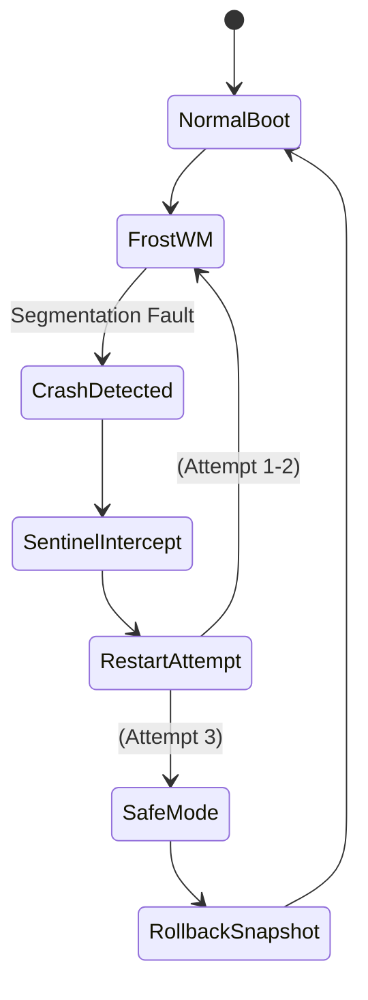

# SnowOS Boot & Recovery Architecture

The traditional Linux boot process (BIOS -> GRUB -> Initramfs -> Plymouth -> Display Manager -> Window Manager) is notoriously disjointed, leading to TTY flickers, black screens, and framebuffer deadlocks.

SnowOS re-architects this pipeline to achieve a continuous, cinematic transition from firmware to the desktop, guaranteeing graceful degradation and instant recovery.

---

## 1. The Boot Pipeline Rebuild

**Objective:** <5 second perceived boot, zero TTY flicker, zero frozen framebuffers, and seamless animated transitions.

### 1.1 Ordered Boot Timeline
1. **UEFI/BIOS Handoff:** System firmware loads the signed GRUB bootloader.
2. **GRUB (Silent Mode):** GRUB is heavily patched to suppress all text output and instantly load the kernel.
3. **Early KMS (Kernel Mode Setting):** The kernel loads the GPU driver directly from initramfs to immediately claim the framebuffer.
4. **Vulkan Splash (Plymouth Replacement):** Instead of Plymouth, SnowOS uses a custom Vulkan-based splash screen (`snowos-splash`). It preloads necessary shaders and renders high-framerate ambient animations.
5. **Systemd Target Handoff:** 
   - `sysinit.target` runs in parallel with the splash screen.
   - `multi-user.target` initializes `snowos-broker` and `snowos-sentinel`.
6. **Digital Frost Greeter:** `snowos-splash` hands the DRM/KMS master node directly to the `snowos-greeter` (Wayland). No VT switching occurs.
7. **FrostWM (Compositor Warmup):** The greeter handles authentication while the main compositor (`FrostWM`) warms up in the background. Upon success, a cross-fade shader transitions the user seamlessly to the desktop.

### 1.2 DRM/KMS Ownership & Deadlock Prevention
- **Eliminating Framebuffer Deadlocks:** Traditional setups fail when Plymouth and X11/Wayland fight for DRM master status. SnowOS uses a unified graphics broker. `snowos-splash` explicitly yields the DRM lease to the greeter, ensuring atomic handoff without resetting the display controller.
- **TTY Ownership:** `getty` services on `tty1` through `tty6` are completely disabled by default. A virtual TTY is only spawned upon explicitly triggering Recovery Mode.

---

## 2. Fallback Hierarchy & Graceful Degradation

**Objective:** Ensure the system boots visually regardless of underlying hardware support.

### 2.1 GPU Capability Scoring
During Early KMS, the `snowos-sentinel` scores the hardware:
- **Score A (Full Vulkan/Wayland):** Native GPU drivers (AMD/Intel/Nvidia proprietary). Full glassmorphism, blur, and 120Hz animations.
- **Score B (Software/Basic Wayland):** Legacy GPUs. Disables heavy shaders; uses pre-rendered video assets for transitions.
- **Score C (Framebuffer/LLVMpipe):** VMs, safe mode, or missing drivers. Drops to a stylized 2D canvas (HTML5/Cairo equivalent).

### 2.2 VM-Aware Rendering Degradation
If `systemd-detect-virt` returns true (e.g., KVM, VirtualBox), the OS automatically triggers **Score C**, ensuring it never attempts to compile complex Vulkan shaders that would crash a virtualized environment.

---

## 3. Recovery Architecture

**Objective:** Every subsystem must fail safely and recover autonomously.

### 3.1 Graphical Safe Mode
If FrostWM crashes three times within 60 seconds, `snowos-sentinel` intercepts the failure and launches **Graphical Safe Mode**.
- Bypasses all AI and rendering layers.
- Boots a static, Weston-based recovery UI.
- Allows the user to select BTRFS snapshots or repair broken updates.

### 3.2 Emergency Recovery Flow

### 3.3 Boot Telemetry Analysis
If a boot takes longer than 15 seconds, the `snowos-optimizer` logs an anomaly. Once reaching the desktop, the Context Engine analyzes the systemd-analyze blame trace to predict and resolve the bottleneck (e.g., "NetworkManager timed out; switching to asynchronous initialization").
