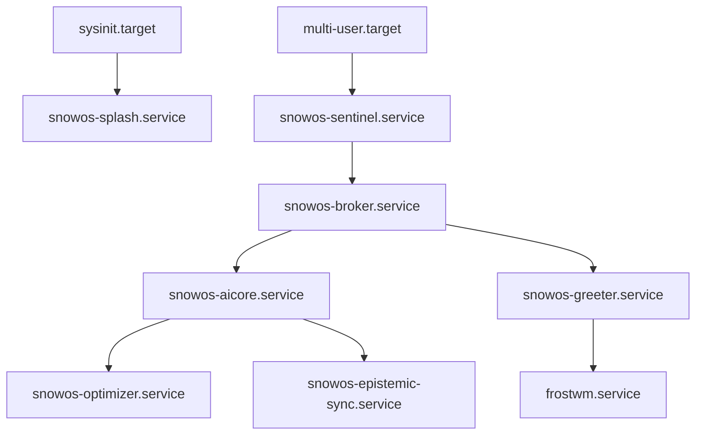

# SnowOS System Topology & Roadmap

This document outlines the internal topology of SnowOS daemons, the filesystem architecture, the technology stack, and the strategic migration path away from an Ubuntu base towards a fully independent platform.

---

## 1. Systemd Dependency Map & Service Topology

SnowOS replaces traditional Linux desktop initialization with a heavily orchestrated, deterministic service graph.

### Core Service Hierarchy

**Service Roles:**
- `snowos-sentinel`: System health watchdog. If `aicore` dies, Sentinel restarts it.
- `snowos-broker`: The IPC policy enforcer.
- `snowos-aicore`: The cognitive brain (local LLM/inference engine).
- `snowos-optimizer`: Context-aware performance scheduler.
- `snowos-epistemic-sync`: Manages external reality syncing.

---

## 2. Immutable Filesystem Design

**Objective:** Prevent recursive AI self-destruction and ensure unbreakable OTA updates.

### Partition Layout:
1. **`/boot/efi`**: Standard UEFI boot partition.
2. **`/system` (Read-Only):** BTRFS subvolume. Contains the kernel, systemd, the Broker, and all OS binaries. The AI *cannot* write here under any circumstance.
3. **`/runtime` (Volatile/Overlay):** `tmpfs`. Contains socket files (`snowos-broker.sock`), PID files, and ephemeral AI memory. Flushed on reboot.
4. **`/user` (Encrypted/Read-Write):** User home directories, Flatpak apps, and the persistent cognitive memory graph.
5. **`/recovery` (Hidden):** BTRFS snapshots of `/system` for atomic rollback.

**Transactional Updates:**
Updates are downloaded in the background, applied to a new BTRFS snapshot of `/system`, and flagged for the next boot. If the boot fails (Sentinel triggers Safe Mode), the system automatically pivots back to the previous snapshot.

---

## 3. Performance Optimization Strategy

SnowOS uses a **Context-Aware Scheduling Architecture**:
- The `snowos-optimizer` dynamically adjusts `cgroups` based on the user's semantic state.
- **Example:** If the user is actively typing in a terminal, the terminal process is elevated to real-time priority. If a heavy ML model is compiling in the background but the user switches to a cinematic game, the compilation is aggressively throttled.
- **Memory Deduplication:** AI embeddings are heavily compressed, and inactive cognitive nodes are swapped to disk to keep RAM free for human applications.

---

## 4. Recommended Technology Stack

- **Kernel/Base:** Linux kernel (latest stable), systemd.
- **System Daemons (Broker, Sentinel):** Rust (for memory safety, zero-cost abstractions, and immutability guarantees).
- **Cognitive Core (aicore, context engine):** Python (PyTorch/ONNX for inference) paired with Rust bindings for speed.
- **Compositor (FrostWM):** C (wlroots) or Rust (Smithay) for Wayland compositing.
- **UI Toolkit:** GTK4 / Libadwaita heavily themed, or raw Vulkan/OpenGL custom renderer for AI overlays to achieve the cinematic glassmorphism.
- **Package Management:** Flatpak (for user apps), OSTree/BTRFS snapshots (for system).

---

## 5. Migration Roadmap: Ubuntu Base to Independent Platform

SnowOS currently relies on an Ubuntu LTS base (hidden in Layer 1). The strategic goal is true autonomy.

### Phase 1: The Abstraction Layer (Current)
- Complete the Frost Shell and replace GNOME.
- Solidify the Broker/Sentinel IPC architecture.
- Rely on `apt` internally, but mask it from the user.

### Phase 2: The Immutable Pivot
- Transition to an A/B partition scheme (OSTree or raw BTRFS snapshots).
- Replace `apt` with an AI-aware atomic update mechanism.
- Containerize all legacy Ubuntu dependencies.

### Phase 3: The Kernel Splice
- Compile a custom SnowOS Linux Kernel optimized for local NPU/GPU inference and real-time UI threading.
- Strip out unused server-oriented Ubuntu packages.

### Phase 4: Full Independence (SnowOS Core)
- Bootstrapping a custom repository.
- Native SnowOS package format (or pure Flatpak).
- Complete severing of the Ubuntu upstream dependency, culminating in a pristine, cognitive-first operating system.
