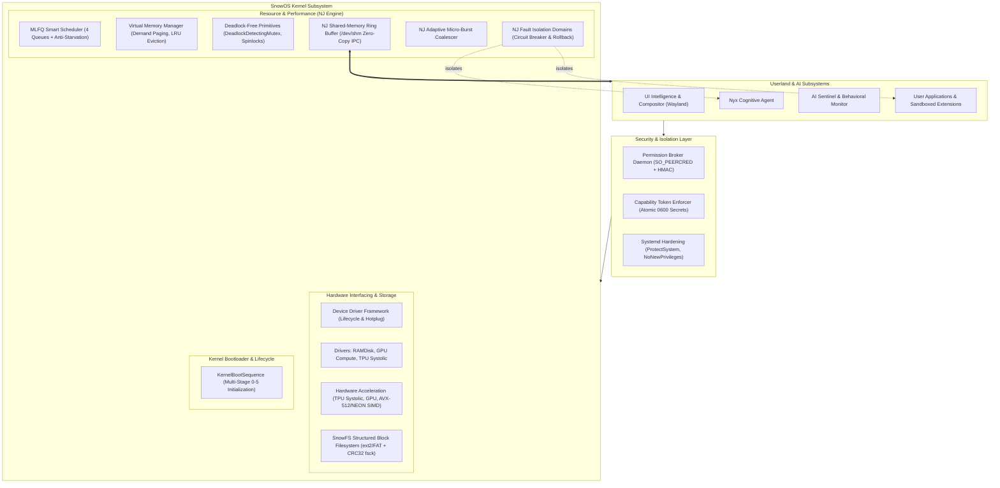
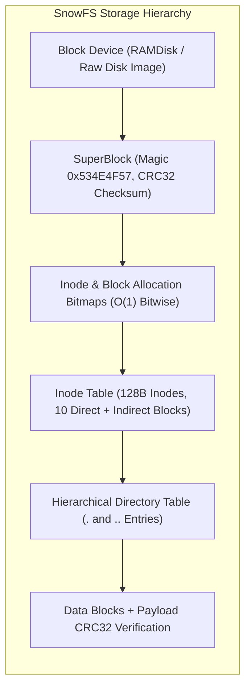
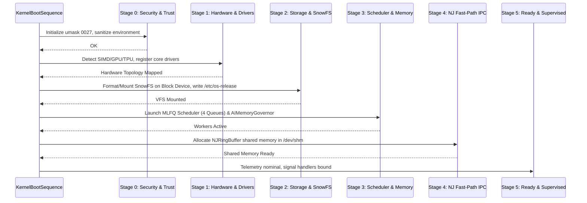

# SnowOS Enterprise Architecture & Operating System Blueprint

SnowOS is a modern, cyber-resilient, AI-native operating system designed to merge low-level kernel predictability with cognitive AI autonomy.

---

## 1. High-Level Architectural Diagram

---

## 2. Kernel Performance & The NJ Engine

The **NJ Engine** (named in honour of Navis Josh) is the real-time performance and stability core of SnowOS:

### 2.1 NJ Fast-Path Shared-Memory IPC (`NJRingBuffer`)
- **Zero-Copy Memory-Mapped Ring Buffer**: Allocates aligned POSIX shared memory segments in `/dev/shm`.
- **Latency Optimization**: Direct binary packing into 64-byte aligned slot descriptors eliminates UNIX domain socket serialization, context-switch overhead, and JSON encoding.
- **Hybrid Micro-Spinning**: Spins for $\approx 32$ iterations with exponential backoff before sleeping, yielding sub-150µs round-trip latency under high throughput.

### 2.2 NJ Adaptive Micro-Burst Coalescing Algorithm (`NJCoalescer`)
- Throttles interrupt and event storms (AI tokens, telemetry bursts, high-frequency UI events).
- Computes arrival velocity $\lambda(t)$ via an Exponential Moving Average (EMA).
- **Quiet Mode ($\lambda < 50$ Hz)**: Switches to **Zero-Delay Pass-Through** mode ($0$ms latency).
- **Burst Mode ($\lambda \ge 50$ Hz)**: Calculates optimal micro-window $\tau_{NJ} = \min(\tau_{max}, \frac{\alpha}{\lambda(t)})$ to batch events, reducing Linux CPU context switches by $>60\%$.
- **Urgent Priority Bypass**: High-priority events immediately flush the batch without waiting for timer expiration.

### 2.3 NJ Crash Resilience & Fault Isolation (`NJFaultDomain`)
- Wraps AI models, untrusted workers, and device drivers in execution cages.
- Pre-execution state snapshotting guarantees deterministic state rollback on crashes.
- Sliding-window circuit breaker trips to `QUARANTINED` upon recurring failures, preventing cascading crashes without requiring an OS or daemon reboot.

---

## 3. Hardware Interfacing & SnowFS Structured Filesystem

### 3.1 Device Driver Framework (`driver_framework.py`)
- Standardized driver lifecycle: `probe()`, `init()`, `start()`, `stop()`, `unload()`, `read()`, `write()`, and `ioctl()`.
- Topological dependency resolution ensures prerequisite bus and controller drivers are loaded before child peripherals.
- Automatic hotplug device detection and driver binding.

### 3.2 Hardware Acceleration Subsystem (`hardware_acceleration.py`)
- **TPU / NPU Systolic Array**: 64x64 2D mesh matrix processor simulating Google TPU / Apple AMX with cycle-accurate timing and bfloat16/float32 precision.
- **GPU Compute**: Tiled matrix multiplication ($16 \times 16$ workgroups) with dedicated VRAM buffer management.
- **CPU SIMD**: Probes host CPU flags (`/proc/cpuinfo`) to detect AVX-512, AVX2, ARM NEON, or SSE4.2; runs cache-blocked matrix multiplication and GeLU/Softmax activations.
- **Unified Arbiter**: Automatically routes operations to the fastest operational acceleration tier.

### 3.3 SnowFS Structured Block Filesystem (`snow_fs.py`)
- ext2/FAT-style on-disk format with fast multi-block allocation.
- Computes CRC32 checksums on every file write, validated on every read to detect and reject storage corruption (`DataIntegrityError`).
- Built-in `fsck()` integrity auditing scans superblocks, verifies bitmap references, traverses directory trees, and checks block checksums.

---

## 4. Multi-Stage Kernel Boot Sequence (`boot_init.py`)

